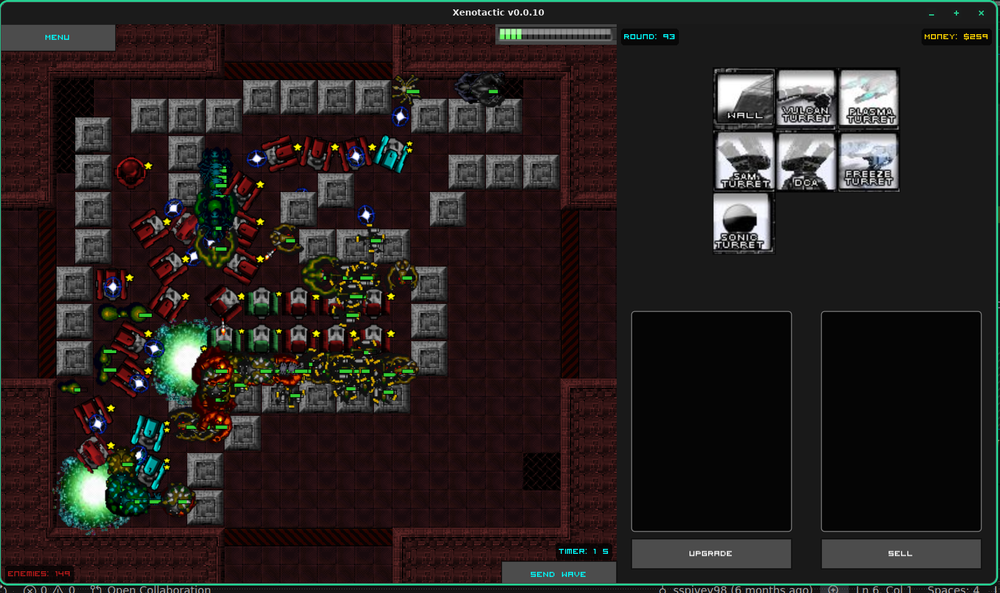

# XenoTactic Remastered
This is a remaster of the browser game, Xeno Tactic, in Love2d. I'm aiming to reproduce the behavior of version 1.3.

## Reference
You can play the original game [here](https://www.newgrounds.com/portal/view/382321).

## Developing
It is highly recommend that you use the following extensions in `VS Code` or `VSCodium`:

| Feature | Code Extension | Codium Extension |
| ------- | -------------- | ---------------- |
| Debugger | [Local Lua Debugger](https://marketplace.visualstudio.com/items?itemName=ismoh-games.second-local-lua-debugger-vscode) | [Second Local Lua Debugger](https://open-vsx.org/extension/tomblind/local-lua-debugger-vscode) |
| Weak Typing | [Lua](https://marketplace.visualstudio.com/items?itemName=sumneko.lua) | [Lua](https://open-vsx.org/extension/sumneko/lua)

### Run it yourself

1.) Download `love2d`

2.) `love . --console`

or...

1.) run 'debug' on the `Local Lua Debugger`